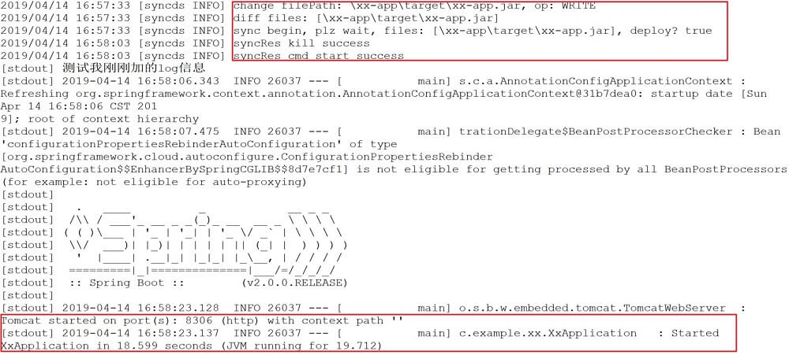

## 描述
实时同步开发代码、编译产出，到线下机器（开发机、测试机），触发部署脚本，并将远程服务stdout实时同步过来

## 背景与用途
本地开发因为办公网限制，无法连db及上下游服务；堡垒机开发通过远程桌面诸多不便还挺卡。
可以用这个工具，在你超高配的本地电脑开发，同步代码或者编译产出到线下机器，再触发部署、重启服务，还能实时看远程服务的控制台输出信息

## 使用方便
### 本地
- 在要同步的代码目录`syncds client --name=app --init` 生成syncds-client.yml配置文件（建议gitignore）
- 修改syncds-client.yml（主要是服务器的ip:port、要同步的文件、部署命令）
- `syncds client -n=app` 本地启动
- 跨平台，windows、mac、linux
- 两种思路：同步源码还是同步编译产出？如果本地可以编译，本地编译可能更好使
- 一般可以使用idea编辑器的Terminal启动脚本，然后就可以实时看远程服务的log

### 目标服务器
- 在要同步的部署目录`syncds server --name=app --init` 生成syncds-server.yml配置文件
- 修改syncds-server.yml（主要是服务器的ip:port）
- `syncds server -n=app` Server启动
- 推荐后台启动 nohup syncds server --name=app > runtime.log 2>&1 &

### 停止
- `syncds stop -n=app` name主要是用来停止的

## 特色
- 基于http协议(websocket)传输，服务端可以使用安全策略开放的http端口
- 将远程deploy命令的stdout、stderr实时同步到本地，方便根据日志开发调试，避免本地和开发机之间频繁切换
- 支持web页面列出服务器的同步目录，方便查看文件列表和更新时间等的http://ip:port
- 同步前根据md5预检查是否需要传输文件，LFU缓存

## 编译
- 如果go编译不方便，有win10 x64、linux x64、macOS x64的可执行文件供备用，在bin文件夹下
- 编译依赖 go get github.com/gorilla/websocket github.com/fsnotify/fsnotify github.com/bluele/gcache github.com/spf13/cobra gopkg.in/yaml.v2
- 编译 go build -o syncds\[.exe\] \*.go

## 效果

## change log
2019-7-5
- 命令行生成默认配置文件模板
- kill上次命令后延迟exec
- 增加stop命令，方便停止后台运行的server

## todo
- 个别情况下stderr没有同步到client
