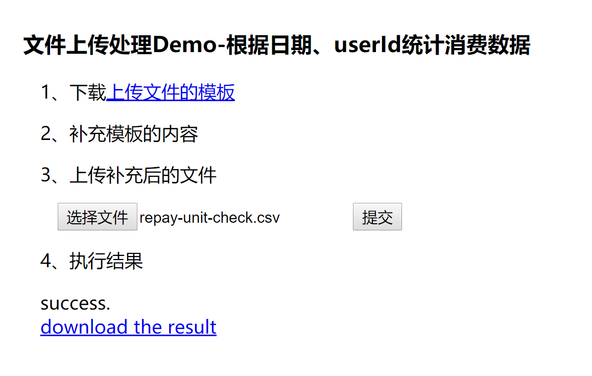

## 描述
这是一个简单的文件上传后，调用脚本执行，并反馈处理结果给前端的小服务工具。

## 背景与用途
经常要给PM跑数（数据统计），有的跑数需求，需要频繁搞。
那么就可以用这个，**把跑数脚本包装成一个简易的服务**。
后续相似的跑数需求，PM就可以自助跑了。

## 使用
- 部署简单 public、upload.go编译后的可执行文件、config.json这三个
- 配置config.json，把你的脚本，包装成依赖上传文件执行的服务
- 如果go编译不方便，有win10 x64、linux x64的可执行文件供备用，在bin文件夹下
- 编译依赖 go get github.com/gin-gonic/gin
- 后台运行启动：nohup ./upload 2>&1 &（记着chmod +x ./upload）
- 默认端口8205，如果需要指定可以./upload 8080
- 前端页面地址是 http://localhost:8205/?app=upload-demo 后面这个是你config.json里配置的

## 效果
